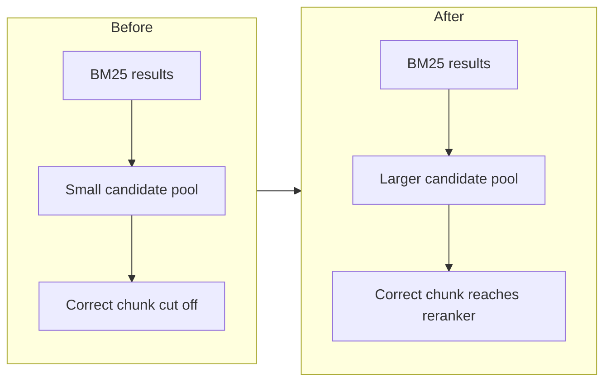

# Notes

## Approach

The system follows a standard RAG workflow:

1. **Ingest.** The supplied documents are inspected and converted into a common JSONL format. PDF pages and spreadsheet rows keep their source details (file name, page, row, and sheet).
2. **Chunk.** The records are split into overlapping chunks.
3. **Retrieve.** Two search methods run together. FAISS finds passages with similar meaning using the `all-MiniLM-L6-v2` embedding model. BM25 finds passages with matching keywords.
4. **Rerank.** Candidates from both methods are merged and re-scored with the `cross-encoder/ms-marco-MiniLM-L-6-v2` reranker.
5. **Generate.** The top chunks are sent to the LLM as context to write the answer.

## Handling Non-English Questions

English questions go straight to retrieval. For other languages, the system detects the language and translates the question to English, so the existing English models can be reused.

I tried three translation options during development:

| Option | Result | Decision |
|---|---|---|
| Google-based translator | Hit request limits | Not used |
| Helsinki translation model | Weak translations | Not used |
| NLLB (`facebook/nllb-200-distilled-600M`) | Worked best for the Hindi questions | **Kept** |

## Problems Faced and What I Learned

### 1. The Bihar Jeevika question

The first version of the pipeline could not find the page that gives the number of self-help groups under Bihar Jeevika. When I checked the retrieval results, the correct chunk was in the BM25 results, but ranked too low to be passed to the reranker. Increasing the size of the candidate pool let this chunk reach the reranker, and the retrieval improved.

**Lesson:** the reranker can only pick from what it is given. A larger candidate pool gives it a better chance to find the right passage.

### 2. Imperfect PDF extraction

Some bilingual government PDFs use legacy Hindi fonts. The extracted Hindi text can look broken, but the English text in the same documents is still usable. I kept the extraction as it was, instead of building a separate OCR or table-rebuilding pipeline within the assignment time.

## Future Improvements

With more time, I would:

- Improve parsing of tables inside PDFs.
- Measure retrieval quality formally on the development set.
- Add stronger multilingual retrieval.
- Add automatic checks that answers are grounded and citations are correct.
