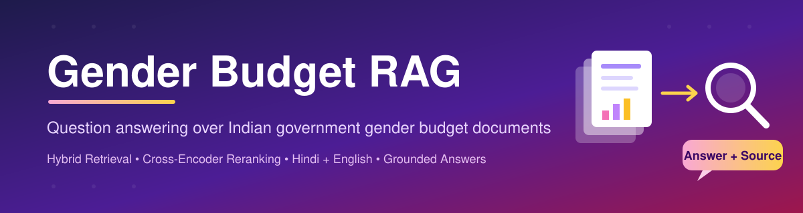
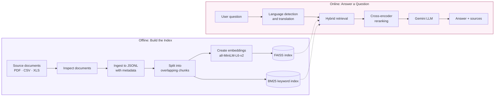
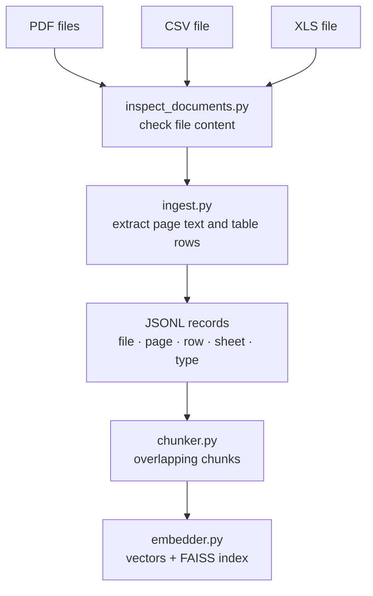
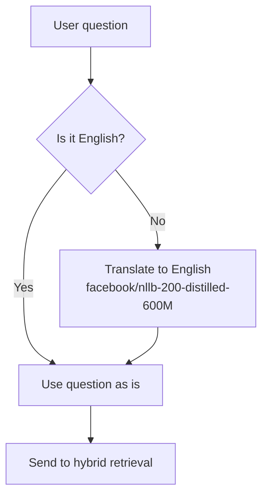
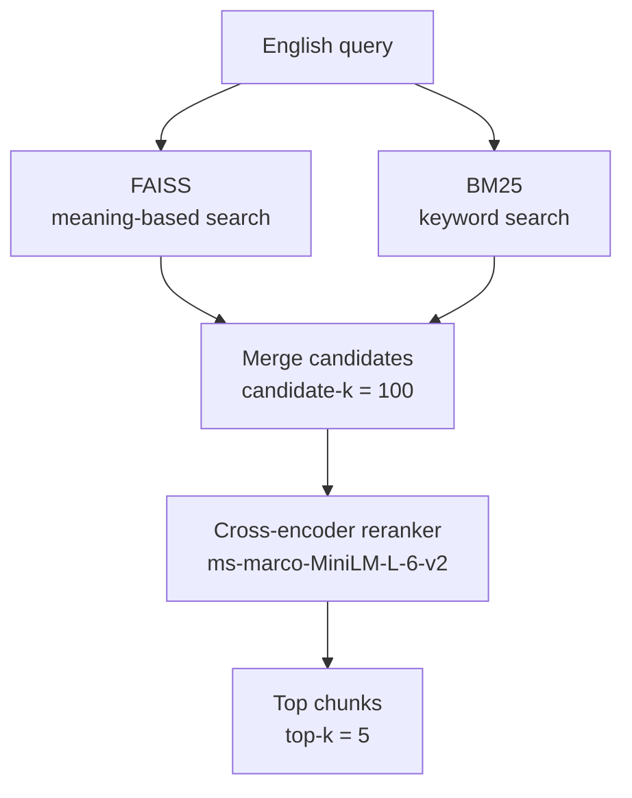
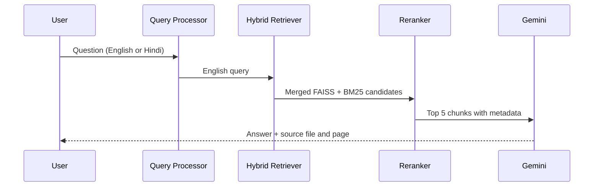
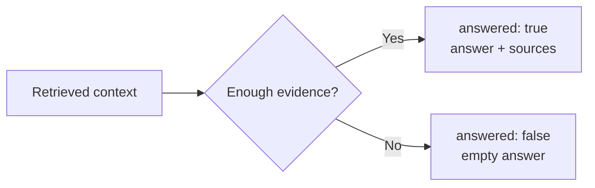

<p align="center">
  
</p>

<p align="center">
  
  
  
  
  
</p>

# Gender Budget RAG

A Retrieval-Augmented Generation (RAG) system that answers questions using Indian government gender budget documents. Every answer is based only on the supplied documents and comes with its source file and page.

## Table of Contents

- [Overview](#overview)
- [Key Features](#key-features)
- [Document Corpus](#document-corpus)
- [System Architecture](#system-architecture)
- [How It Works](#how-it-works)
- [Tech Stack](#tech-stack)
- [Project Structure](#project-structure)
- [Setup](#setup)
- [Usage](#usage)
- [Output Format](#output-format)
- [Limitations](#limitations)
- [Future Improvements](#future-improvements)
- [Assignment Deliverables](#assignment-deliverables)

## Overview

Government gender budget documents are long, full of tables, and often mix Hindi and English. Finding a single number in them by hand takes time.

This project makes that easier. You ask a question in English or Hindi, and the system:

1. Finds the most relevant passages from the documents.
2. Sends those passages to an LLM.
3. Returns a short answer with the source file and page.

If the documents do not contain enough evidence, the system says so instead of guessing.

## Key Features

| Feature | What it means |
|---|---|
| **Hybrid retrieval** | Combines meaning-based search (FAISS) with keyword search (BM25), so both general questions and exact terms or numbers are found. |
| **Reranking** | A cross-encoder re-scores the combined results and keeps only the best passages. |
| **Hindi support** | Non-English questions are translated to English before search. |
| **Source tracking** | File name, page, row, and sheet are kept from ingestion to the final answer. |
| **No guessing** | When evidence is weak, the answer is marked as `answered: false`. |

## Document Corpus

| Item | Details |
|---|---|
| Number of documents | 11 |
| Governments covered | Government of India, Bihar, Delhi, Odisha |
| Time period | Multiple budget years |
| File types | PDF, CSV (1), XLS (1) |
| Languages | English and bilingual Hindi/English |

## System Architecture

The system has two parts. The **offline** part builds the search indexes once. The **online** part answers each question.



## How It Works

### Step 1: Ingestion and Chunking

Each document is read and turned into a common JSONL format. PDF pages and spreadsheet rows keep their source details, so every chunk can be traced back to where it came from.



### Step 2: Query Processing

The language of the question is detected first. English questions go straight to search. Other languages are translated to English with NLLB, so the same English search models can be used.



### Step 3: Hybrid Retrieval and Reranking

FAISS and BM25 each return a list of candidates. The two lists are merged, and the cross-encoder picks the best passages for the LLM.



**Why use both?** FAISS finds passages with similar meaning even when the words are different. BM25 finds exact matches such as scheme names, district names, and numbers. Together they miss less.

### Step 4: Answer Generation

The top chunks are sent to Gemini with an instruction to answer only from the given context.



### Step 5: Answer or Decline



## Tech Stack

| Component | Tool / Model |
|---|---|
| Embedding model | `sentence-transformers/all-MiniLM-L6-v2` |
| Vector search | FAISS |
| Keyword search | BM25 |
| Reranker | `cross-encoder/ms-marco-MiniLM-L-6-v2` |
| Translation | `facebook/nllb-200-distilled-600M` |
| Generation | Gemini API |

## Project Structure

```text
gender_budget_rag/
│
├── assets/
│   └── banner.svg               # README banner
│
├── data/                        # Source documents
│
├── src/
│   ├── inspect_documents.py     # Check document contents
│   ├── ingest.py                # Extract text and rows to JSONL
│   ├── chunker.py               # Create overlapping chunks
│   ├── embedder.py              # Build embeddings and FAISS index
│   ├── bm25_retriever.py        # Keyword search
│   ├── hybrid_retriever.py      # FAISS + BM25 + reranking
│   ├── query_processor.py       # Language detection and translation
│   ├── test_query_processor.py  # Tests for query processing
│   ├── test_local_translation.py# Tests for the translation model
│   ├── test_retrieval.py        # Retrieval checks on dev questions
│   ├── llm_generator.py         # Gemini answer generation
│   └── generate_answers.py      # Produce answers.jsonl
│
├── questions_dev.jsonl          # Development questions
├── questions_eval.jsonl         # Evaluation questions
├── answers.jsonl                # Final answers
├── SCOPE.md
├── NOTES.md
├── README.md
├── requirements.txt
└── .gitignore
```

## Setup

### 1. Clone the repository

```bash
git clone <YOUR_GITHUB_REPOSITORY_URL>
cd gender_budget_rag
```

### 2. Create and activate a virtual environment (Windows)

```cmd
python -m venv rag
rag\Scripts\activate
```

### 3. Install dependencies

```cmd
pip install -r requirements.txt
```

### 4. Add your API key

Create a `.env` file in the project root:

```text
GEMINI_API_KEY=your_api_key_here
```

> **Note:** Do not commit `.env` to GitHub.

You can also choose the Gemini models:

```cmd
set GEMINI_MODEL=gemini-3.1-flash-lite
set GEMINI_FALLBACK_MODEL=gemini-3.5-flash-lite
```

## Usage

### Build the retrieval index

Run these commands in order:

```cmd
python src\inspect_documents.py
python src\ingest.py
python src\chunker.py
python src\embedder.py
```

This creates the processed records, chunks, embeddings, and FAISS index.

### Test retrieval

```cmd
python src\test_retrieval.py
```

This prints the top retrieved chunks and their source details for each development question.

### Generate evaluation answers

```cmd
python src\generate_answers.py --questions questions_eval.jsonl --output answers.jsonl --top-k 5 --candidate-k 100
```

| Argument | Meaning |
|---|---|
| `--questions` | Input questions file |
| `--output` | Where to save the answers |
| `--top-k` | Number of chunks sent to the LLM |
| `--candidate-k` | Number of candidates collected before reranking |

This processes all 18 evaluation questions and writes `answers.jsonl`.

## Output Format

Each line in `answers.jsonl` is one JSON object.

**When the system can answer:**

```json
{
  "question_id": "E01",
  "answered": true,
  "answer": "Rs 23.3 crore",
  "sources": [
    {
      "file": "gender_budget_2023-24.pdf",
      "page": 1
    }
  ]
}
```

**When the evidence is not enough:**

```json
{
  "question_id": "E18",
  "answered": false,
  "answer": "",
  "sources": []
}
```

## Limitations

- **Text extraction is not perfect.** Some PDFs use old Hindi fonts, so the Hindi text may look broken. The English text is still usable.
- **Tables are stored as rows.** CSV and XLS data is kept as extracted rows, not rebuilt into a full database.
- **No OCR.** Scanned content is not processed separately.
- **Corpus only.** The system answers only from the supplied documents and does not use outside knowledge.

## Future Improvements

- Better parsing for tables inside PDFs.
- Formal retrieval evaluation on the development set.
- Stronger multilingual retrieval without depending on translation.
- Automatic checks that each answer matches its cited source.

## Assignment Deliverables

| File | Description |
|---|---|
| `SCOPE.md` | What the system covers and what it does not |
| `NOTES.md` | Design choices, problems faced, and next steps |
| `answers.jsonl` | Answers for the 18 evaluation questions |

The repository also includes all code needed to reproduce the system: ingestion, chunking, indexing, retrieval, reranking, translation, and generation.
